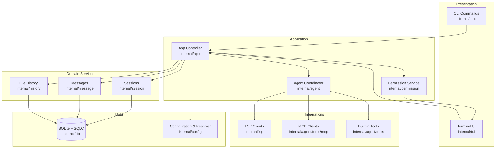
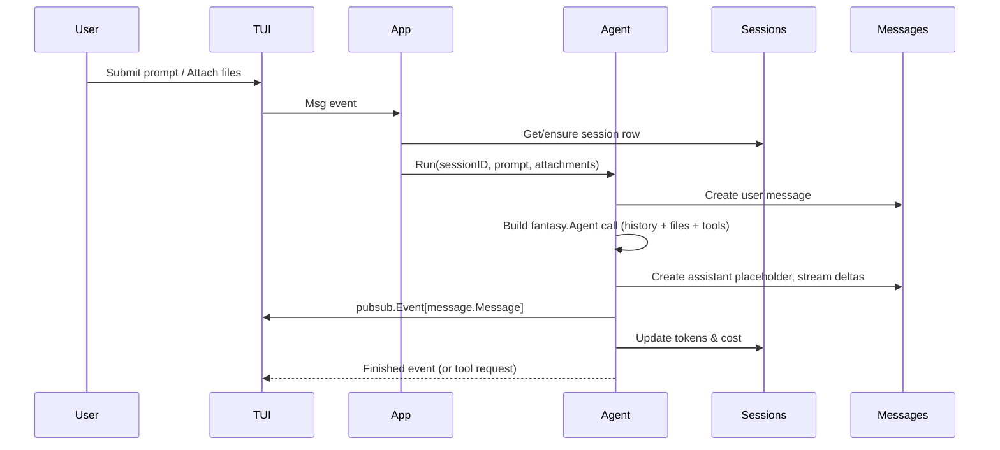
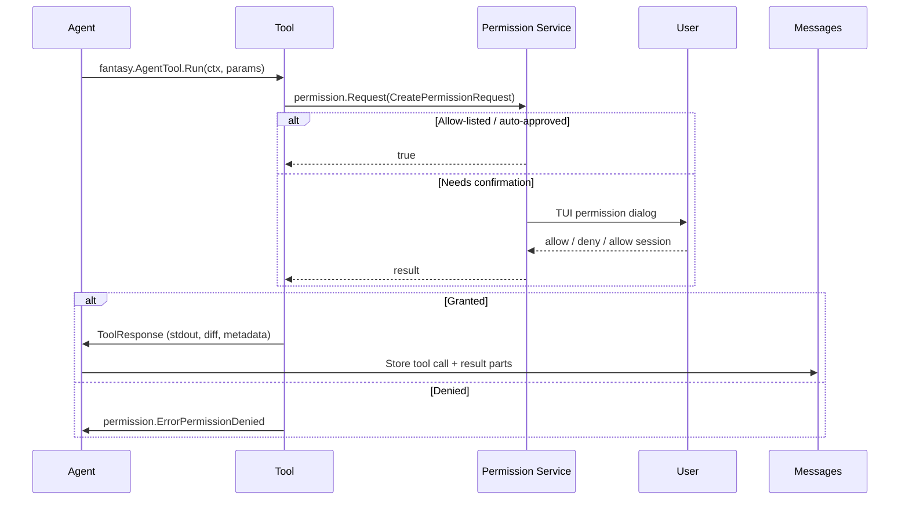
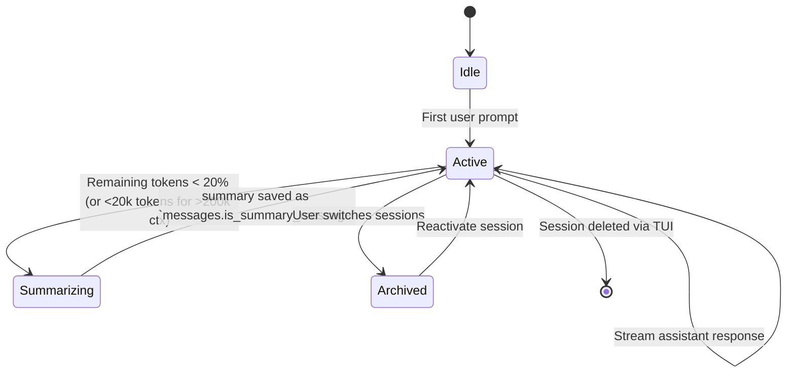

# Architecture Overview

## 🏗️ Architectural Principles

Crush is designed as a terminal-first assistant. Every layer favors:

1. **Deterministic UX** – Bubble Tea v2 components in `internal/tui` keep rendering predictable and testable.
2. **Message-Driven Orchestration** – Long‑running services publish `pubsub.Event[T]` objects so the TUI, background services, and non-interactive mode all react the same way.
3. **Provider Agnostic AI** – The `internal/agent` package speaks to models via [`charm.land/fantasy`](https://pkg.go.dev/charm.land/fantasy), enabling OpenAI, Anthropic, Bedrock, Google, Groq, etc. through configuration rather than code changes.
4. **Session Isolation** – `internal/session`, `internal/message`, and `internal/history` guarantee that every run happens inside a discrete SQLite conversation with auditable file history.
5. **Tool Safety First** – The permission service in `internal/permission` gates every potentially destructive action (filesystem, shell, MCP) and surfaces prompts inside the TUI.
6. **Extensibility** – LSP (`internal/lsp`) and MCP (`internal/agent/tools/mcp`) adapters allow new tooling without touching the agent core.

## 🎯 High-Level Architecture

### Layer Guide

| Layer | Code | Responsibilities |
| --- | --- | --- |
| Presentation | `internal/tui`, `internal/cmd` | Bubble Tea chat UI, dialogs, key mappings, Cobra CLI flags, non-interactive run mode |
| Application | `internal/app` | Wiring database connection, services, permission broker, MCP/LSP lifecycle, agent coordinator, graceful shutdown |
| Domain Services | `internal/session`, `internal/message`, `internal/history`, `internal/permission` | CRUD + pubsub for sessions/messages/files, permission prompts, history snapshots |
| Agent Layer | `internal/agent` | `Coordinator` selects models, manages session queues, streams responses; `sessionAgent` handles summarization, token accounting, fantasy Agent integration |
| Integrations | `internal/agent/tools`, `internal/agent/tools/mcp`, `internal/lsp` | Built-in tools (view/edit/bash/etc.), MCP servers (stdio/http/sse), LSP clients for diagnostics/references |
| Data/Config | `internal/db`, `internal/config` | SQL migrations + sqlc queries, configuration merge + schema validation |

## 🔄 Key Workflows

### 1. Conversation Lifecycle

**Where it lives:** `internal/agent/agent.go` implements `sessionAgent.Run`, streaming callbacks (`OnTextDelta`, `OnToolInputStart`, etc.) and context-window enforcement; `internal/agent/coordinator.go` picks models and merges provider options.

### 2. Tool Execution & Permissions

**Where it lives:** The Bash, edit, write, download, fetch, diagnostics, and MCP proxies in `internal/agent/tools/*.go` all call `permission.Service.Request`. The TUI listens on `pubsub.Event[permission.PermissionRequest]` in `internal/tui/tui.go` and renders dialogs.

### 3. Session Maintenance & Summaries

`internal/agent/agent.go` lines 360‑395 track prompt/completion tokens per session and call `sessionAgent.Summarize` when the threshold is crossed. The summarizer uses a smaller model configured in `config.SelectedModel`.

## 📚 Reference Docs

Each layer has a focused document:

- [App Controller Module](architecture/01_Core_Modules/App_Controller.md)
- [AI Agent System](architecture/01_Core_Modules/AI_Agent_System.md)
- [Tool System](architecture/01_Core_Modules/Tool_System.md)
- [Permission System](architecture/01_Core_Modules/Permission_System.md)
- [LSP Integration](architecture/01_Core_Modules/LSP_Integration.md)
- [MCP Integration](architecture/01_Core_Modules/MCP_Integration.md)
- [Database Layer](architecture/01_Core_Modules/Database_Layer.md)
- [Business Workflows](architecture/02_Business_Workflows.md)
- [Data Model](architecture/03_Data_Model.md)
