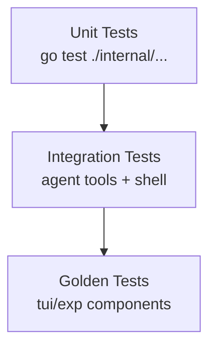

# Testing Strategy

Crush uses plain `go test` plus a few helper tasks from `Taskfile.yaml`. The goal is to keep fast unit tests for core packages and use golden files for the Bubble Tea UI.

## 🧱 Test Pyramid



- **Unit tests** cover helpers such as `internal/csync`, `internal/permission`, `internal/shell`, and database services.
- **Integration tests** exercise agent tooling (e.g., `internal/agent/tools/multiedit_test.go`, `internal/shell/background_test.go`).
- **Golden tests** in `internal/tui/exp` ensure visual components render the same ANSI art over time.

## 📂 Test Layout Highlights

| Package | Tests |
| --- | --- |
| `internal/permission` | `permission_test.go` validates auto-approve, per-session grants, and notification publishing. |
| `internal/shell` | `background_test.go`, `comparison_test.go`, `command_block_test.go` cover job lifecycle and command parsing. |
| `internal/csync` | `maps_test.go`, `slices_test.go`, `versionedmap_test.go` use fuzz-style iteration tests to guard concurrent access. |
| `internal/agent/tools` | `multiedit_test.go`, `job_test.go`, `grep_test.go` (via the shared tooling harness) ensure tools produce the expected responses. |
| `internal/tui/exp/...` | Hundreds of `.golden` files keep scrolling behavior, diff viewers, and lists deterministic. |

Use Ripgrep to locate additional suites:

```bash
rg --files -g '*_test.go'
```

## 🧪 Running Tests

```bash
# Run everything
$ go test ./...

# Or use the task runner (adds -race/-count flags)
$ task test

# Update Bubble Tea golden files after intentional UI changes
$ go test ./internal/tui/... -update

# Focus on a single integration test
$ go test ./internal/agent/tools -run TestMultiEditApplyEdits
```

> Golden tests rely on `.golden` fixtures stored next to each test. Always run with `-update` intentionally; CI should only run in verify mode.

## 🧩 Test Utilities

- `internal/agent/common_test.go` bootstraps in-memory services (sessions, messages, permissions) for tool tests.
- `internal/testenv` (when present) provides helpers for temporary directories and environment isolation.
- `config.ResetProviders()` can be used in tests that modify global provider caches.

## ✅ Best Practices

1. **Prefer real services** – Because services are thin wrappers over sqlc, it is often simpler to run against an in-memory SQLite database (see `db.Connect` with a temp dir) instead of mocking database layers.
2. **Use `t.Parallel()` liberally** – Most packages are thread-safe and the CI pipeline benefits from parallel runs.
3. **Avoid network calls** – Tests should stub or fake provider responses. Tool tests keep everything local.
4. **Keep fixtures small** – History/file tests should assert on short strings to keep golden files readable.

## 🔁 Continuous Integration

The GitHub Actions workflow (`.github/workflows/build.yml`) runs `go test ./...` plus `task lint`. Adding new tests requires no extra wiring.
