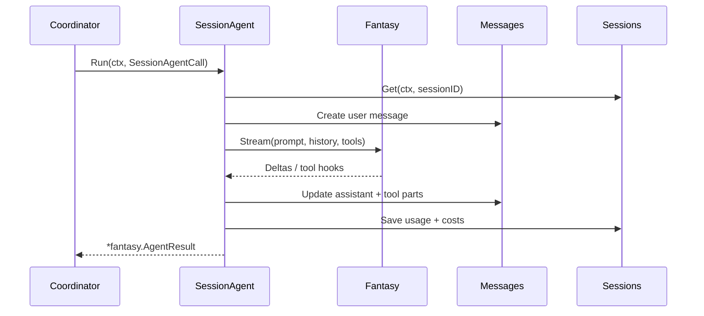

# AI Agent System

## 🤖 Overview

All conversational reasoning lives in `internal/agent`. The package is split into two cooperating pieces:

- **Coordinator (`coordinator.go`)** – Selects the large/small models configured in `crush.json`, merges provider options, and exposes the `Run`, `Cancel`, and `Summarize` APIs consumed by the TUI and CLI.
- **Session Agent (`agent.go`)** – Wraps `fantasy.Agent` to stream assistant responses, execute tools, throttle concurrent calls per session, and keep tokens/costs in sync with the database services.

The agent never talks to providers directly; it delegates to `charm.land/fantasy`, which already knows how to reach Anthropic, OpenAI, Bedrock, Google Gemini, OpenRouter, etc.

## 🧱 SessionAgent Structure

```go
// internal/agent/agent.go
 type sessionAgent struct {
     largeModel           Model
     smallModel           Model
     systemPromptPrefix   string
     systemPrompt         string
     tools                []fantasy.AgentTool
     sessions             session.Service
     messages             message.Service
     disableAutoSummarize bool
     isYolo               bool

     messageQueue   *csync.Map[string, []SessionAgentCall]
     activeRequests *csync.Map[string, context.CancelFunc]
 }
```

Key responsibilities:

- **Queueing** – When one session is already streaming, additional prompts are buffered in `messageQueue` and stitched into the next provider request via the `PrepareStep` callback.
- **Streaming Hooks** – `fantasy.AgentStreamCall` is configured with `OnTextDelta`, `OnToolInputStart`, `OnToolCall`, `OnToolResult`, `OnReasoning*`, etc., and each handler persists state through `message.Service` so the UI can redraw incrementally.
- **Context Management** – Inside `StopWhen`, the agent checks `currentSession.PromptTokens + currentSession.CompletionTokens` against the model’s context window. Once the remaining tokens fall below 20 % (or 20 k tokens for 200 k+ models), it flips `shouldSummarize` and stops streaming so `Summarize` can run on the small model.
- **Tool Context** – Every tool invocation inherits the session ID and the provisional assistant message ID through `context.WithValue` (see `tools.SessionIDContextKey` and `tools.MessageIDContextKey`), making it easy for tool code to locate the right records.

## 🧠 Coordinator Responsibilities

```go
// internal/agent/coordinator.go
type coordinator struct {
    cfg         *config.Config
    sessions    session.Service
    messages    message.Service
    permissions permission.Service
    history     history.Service
    lspClients  *csync.Map[string, *lsp.Client]

    currentAgent SessionAgent
}
```

The coordinator performs per-request work before the `sessionAgent` runs:

1. **Model Selection** – Each agent uses two `config.SelectedModel` entries (`large` for normal turns, `small` for summarization). The coordinator reads provider settings from `config.Config`, computes the default max output tokens, and injects reasoning options specific to each provider (`reasoning_effort`, top‑k/p, etc.).
2. **Provider Options Merge** – `mergeCallOptions` combines model overrides, provider defaults, and catwalk model options via `github.com/qjebbs/go-jsons` so the final `fantasy.ProviderOptions` contains every knob the SDK understands.
3. **Attachment Guardrails** – If a model lacks vision support (`CatwalkCfg.SupportsImages`), file attachments are stripped automatically to avoid provider errors.
4. **Public API** – `Coordinator.Run` is invoked from `internal/app/app.go` both for interactive and non-interactive flows. Cancelation is session-aware, so hitting `Esc` in the TUI only cancels the active request for that session.

## 🔄 Streaming Flow



### Hooks Worth Knowing

| Callback | Implementation detail |
| --- | --- |
| `PrepareStep` | Flushes queued prompts, injects cache-control provider options (Anthropic caching), creates the assistant placeholder row, and ensures the system prompt prefix is always first. |
| `OnToolInputStart` & `OnToolCall` | Mirror provider tool call state into `message.ToolCall` structures so the UI can render progress while tools run. |
| `OnToolResult` | Persists tool output as a `message.Tool` entry, keeping tool results searchable and exportable. |
| `OnStepFinish` | Records finish reason, updates session token counters, and writes cost metadata (including OpenRouter pricing if available). |
| `StopWhen` | Enforces the remaining-context rule described above and triggers summarization by returning `true` when the buffer is low. |

## 🧰 Tool Registration

`internal/agent/agent.go` lazily attaches built-in tools as soon as they are needed:

```go
func (c *coordinator) buildTools(ctx context.Context, agent config.Agent) ([]fantasy.AgentTool, error) {
    tools := []fantasy.AgentTool{
        tools.NewBashTool(c.permissions, c.cfg.WorkingDir(), c.cfg.Options.Attribution),
        tools.NewJobOutputTool(),
        tools.NewJobKillTool(),
        tools.NewDownloadTool(c.permissions, c.cfg.WorkingDir(), nil),
        tools.NewEditTool(c.lspClients, c.permissions, c.history, c.cfg.WorkingDir()),
        tools.NewMultiEditTool(c.lspClients, c.permissions, c.history, c.cfg.WorkingDir()),
        tools.NewFetchTool(c.permissions, c.cfg.WorkingDir(), nil),
        tools.NewGlobTool(c.cfg.WorkingDir()),
        tools.NewGrepTool(c.cfg.WorkingDir()),
        tools.NewLsTool(c.permissions, c.cfg.WorkingDir(), c.cfg.Tools.Ls),
        tools.NewSourcegraphTool(nil),
        tools.NewViewTool(c.lspClients, c.permissions, c.cfg.WorkingDir()),
        tools.NewWriteTool(c.lspClients, c.permissions, c.history, c.cfg.WorkingDir()),
    }
    if len(c.cfg.LSP) > 0 {
        tools = append(tools, tools.NewDiagnosticsTool(c.lspClients), tools.NewReferencesTool(c.lspClients))
    }
    tools = append(tools, tools.GetMCPTools(c.permissions, c.cfg.WorkingDir())...)
    return filterAllowed(agent, tools), nil
}
```

Because `csync.LazySlice` postpones initialization, startup stays fast even when dozens of MCP tools are configured.

## 🧾 Database & Analytics Integration

- **Messages (`internal/message`)** – Every delta mutates the assistant row and appends typed parts (`TextContent`, `ReasoningContent`, `ToolCall`, `ToolResult`).
- **Sessions (`internal/session`)** – Token counts and costs accumulate on the session row so the TUI can sort sessions by activity and show usage totals.
- **History (`internal/history`)** – Tools that mutate files create new versions through the history service, giving the agent accurate file context and allowing the user to inspect change history inside the UI.

## 🔌 Related Docs

- [Tool System](Tool_System.md)
- [Permission System](Permission_System.md)
- [Business Workflows](../02_Business_Workflows.md)
- [Data Model](../03_Data_Model.md)
