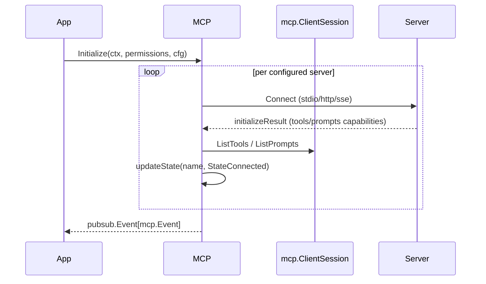

# MCP Integration

Model Context Protocol (MCP) support lets Crush load external tool providers (filesystem helpers, knowledge bases, proprietary APIs). The implementation lives in `internal/agent/tools/mcp` and uses the official `github.com/modelcontextprotocol/go-sdk` package.

## Components

| File | Responsibility |
| --- | --- |
| `init.go` | Loads MCP configs, launches clients, tracks state, publishes events. |
| `tools.go` | Caches tool lists per MCP server and exposes `RunTool`. |
| `prompts.go` | Mirrors MCP prompt catalogs for use inside the TUI. |

## Lifecycle



- **Transports**: `config.MCPConfig.Type` can be `stdio`, `http`, or `sse`.
  - *stdio*: runs a local executable via `exec.CommandContext`. Working directory is the Crush workspace, so MCP servers can read/write files if granted permission.
  - *http/sse*: uses Go’s `net/http` client with optional headers/timeouts defined in the config.
- **Timeouts**: `Timeout` controls both connection and tool-call deadlines. Defaults to 15 s.
- **Permissions**: When MCP tools attempt to touch the filesystem or shell, they still go through the same permission service because MCP tools are wrapped as regular agent tools (`tools.GetMCPTools`).

## Configuration Example

```json
{
  "mcp": {
    "filesystem": {
      "type": "stdio",
      "command": "npx",
      "args": ["@modelcontextprotocol/server-fs"],
      "timeout": 60,
      "env": {
        "FS_ROOT": "$(pwd)"
      }
    },
    "github": {
      "type": "http",
      "url": "https://example.com/mcp",
      "headers": {
        "Authorization": "Bearer $(echo $GITHUB_TOKEN)"
      }
    }
  }
}
```

## Tool Execution

```go
func RunTool(ctx context.Context, serverName, toolName, input string) (string, error) {
    args := map[string]any{}
    json.Unmarshal([]byte(input), &args)
    session, err := getOrRenewClient(ctx, serverName)
    result, err := session.CallTool(ctx, &mcp.CallToolParams{
        Name:      toolName,
        Arguments: args,
    })
    return flattenContent(result.Content), err
}
```

The result is returned as newline-joined text chunks so it can be fed back into the agent conversation.

## UI Integration

- `mcp.SubscribeEvents` publishes state changes (starting, connected, error). The TUI shows them in the status area and inside the MCP dialog.
- When a server exposes prompts, the `/commands` dialog lists them and lets the user run pre-defined instructions directly.

## Operational Tips

- Stdio servers inherit Crush’s environment. Use `env`/`home.Long` to point to per-project configs if needed.
- `getOrRenewClient` automatically restarts stdio servers that crash. Persistent failures update the status to `StateError` and show the error message in the UI.
- To add custom MCP tooling, drop a new entry into `crush.json` and ensure the server responds to the standard MCP handshake.
