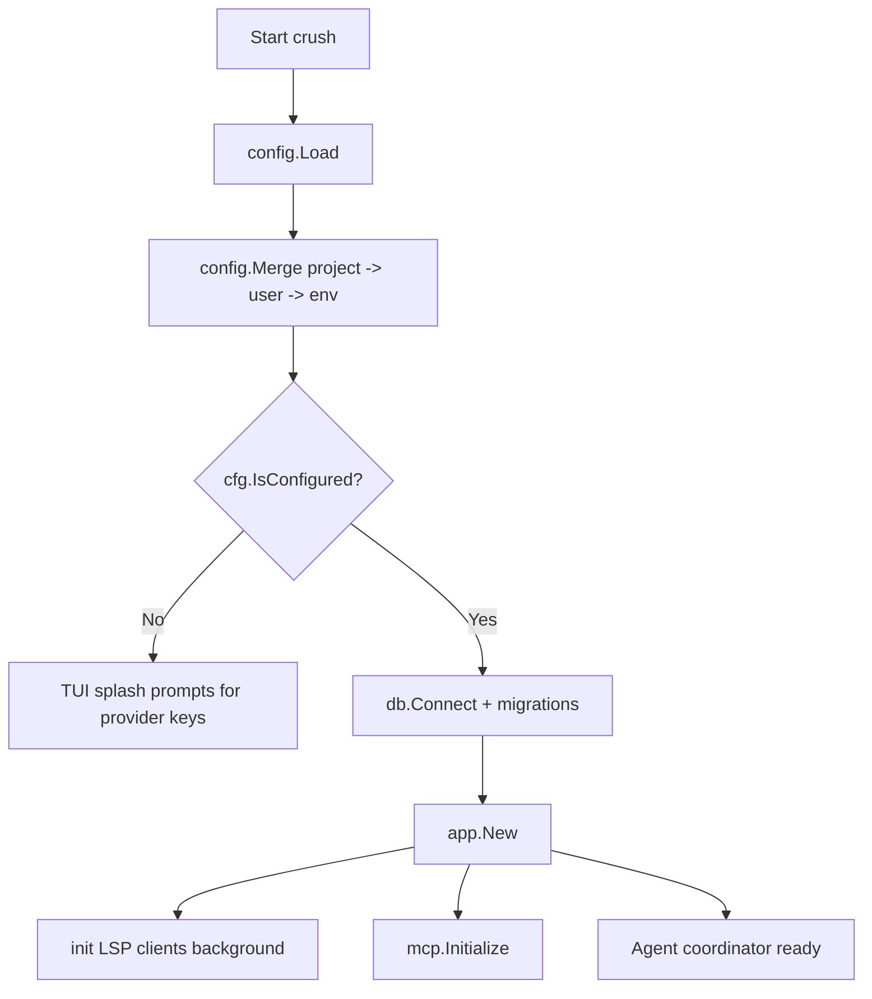
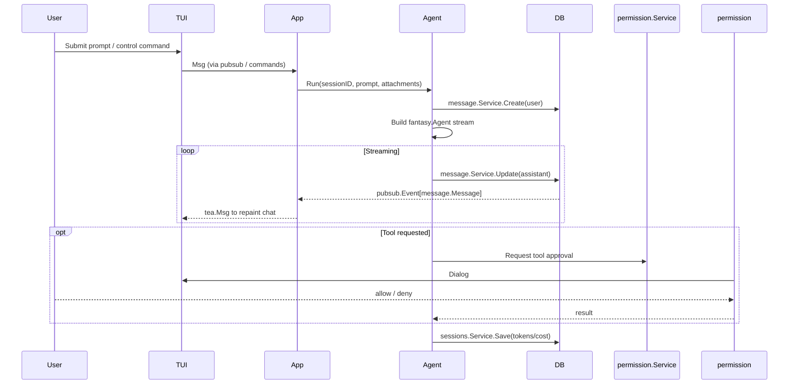
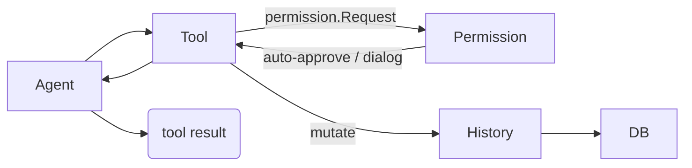
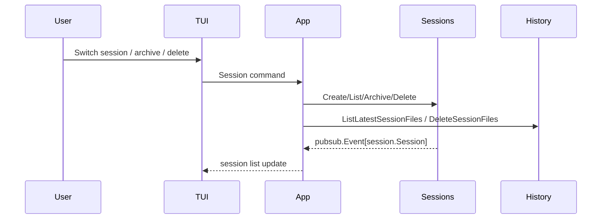

# Business Workflows & Data Flow Analysis

This section walks through the most common flows in Crush and points to the concrete packages/functions that implement them.

## 1. Onboarding & Configuration Loading

- `internal/config/config.go` merges `crush.json`, `.crush.json`, `$XDG_CONFIG_HOME`, and env overrides, then validates against `schema.json`.
- `internal/db/connect.go` applies Goose migrations and sets SQLite pragmas.
- `internal/app/app.go` wires services, permission broker, MCP clients, and eventually the agent coordinator.

## 2. Interactive Conversation Flow

> **Source:** `internal/agent/agent.go` (`sessionAgent.Run`) and `internal/tui/tui.go` message cases.

### Context Summaries

When `StopWhen` detects fewer than 20 % (or <20k tokens on >200k models) remaining tokens, the agent stops streaming, calls `sessionAgent.Summarize`, and writes the summary back as a `messages.is_summary_message` row. The UI tags those summaries so they can be collapsed or expanded per session.

## 3. Tool Execution & File Safety

- `internal/agent/tools/*.go` contain built-in helpers (view/edit/write/bash/grep/glob/ls/fetch/download/jobs, diagnostics/references) plus MCP proxies.
- Every tool constructs a `permission.CreatePermissionRequest` with the session ID, action, and normalized path. Allowed tools from configuration bypass prompts, otherwise the TUI dialog defined in `internal/tui/components/dialogs/permissions` is displayed.
- File mutations go through `internal/history/file.go` so the agent and user can inspect previous versions.

## 4. MCP and LSP Lifecycles

- MCP clients are launched from `internal/app/app.go` via `mcp.Initialize`. Each configured server (`config.MCP`) runs in its own goroutine, updates the shared `mcp.states` map, and streams events for the TUI to render status badges.
- LSP clients are lazy-initialized per entry in `config.LSP`. `internal/lsp/client.go` wraps the `powernap` implementation, tracks diagnostics per document, and exposes helper tools (`diagnostics`, `references`) to the agent.

## 5. Session Maintenance & History

- `internal/session/service.go` wraps the generated sqlc queries and emits pubsub events for the TUI to keep the session sidebar in sync.
- The history service maintains per-session file versions (`version` column) so “view” and “edit” tools have stable snapshots to compare against.

## 6. Non-interactive Mode

When `crush run "prompt"` is invoked, `internal/app/app.go:119` creates a temporary session, auto-approves permissions for that session, streams the response to stdout, and shuts down without starting the Bubble Tea program. This path reuses the exact same services and agent code paths to avoid divergence.

## References

- [AI Agent System](01_Core_Modules/AI_Agent_System.md)
- [Tool System](01_Core_Modules/Tool_System.md)
- [Permission System](01_Core_Modules/Permission_System.md)
