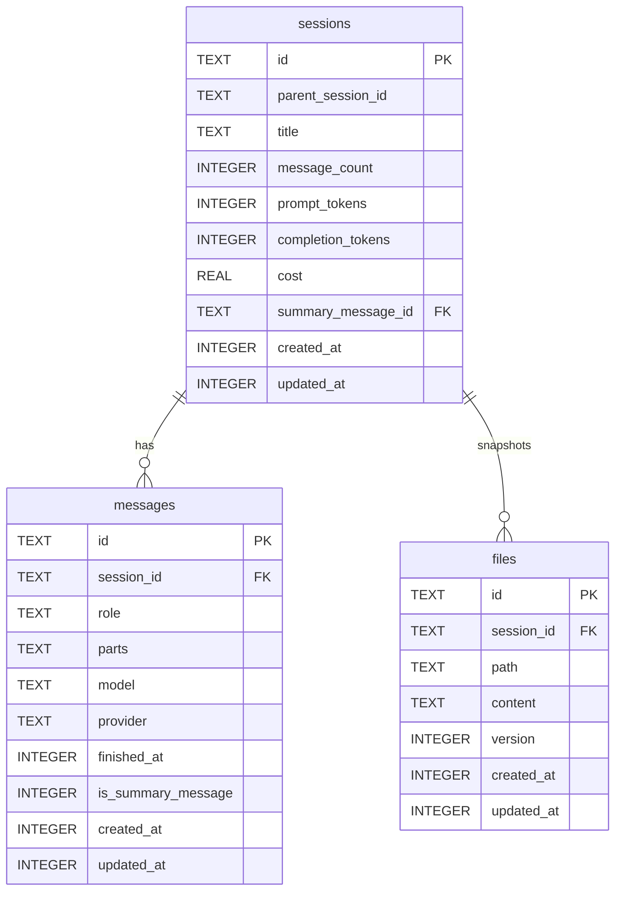

# Data Model & Persistence Layer

Crush stores everything in a single SQLite database located in the data directory (defaults to `.crush/crush.db`). All queries are generated via [sqlc](https://sqlc.dev) from SQL files in `internal/db/sql`, and migrations live under `internal/db/migrations`.

## 🗄️ Schema Overview



### Sessions (`internal/db/migrations/20250424200609_initial.sql`)

- `message_count` is maintained via INSERT/DELETE triggers.
- `prompt_tokens`, `completion_tokens`, and `cost` are incremented in `internal/agent/agent.go` (`updateSessionUsage`).
- `summary_message_id` (added in `20250515105448_add_summary_message_id.sql`) links a session to the message row that contains the latest summary text.

### Messages

- Stores streaming content in `parts` as a JSON array of typed structures (see `internal/message/content.go`).
- `is_summary_message` (migration `20250810000000_add_is_summary_message.sql`) flags system-generated summaries so the UI can collapse them.
- `provider` column (migration `20250627000000_add_provider_to_messages.sql`) records which backend produced the assistant response for later analytics.

### Files

- Each write/edit tool invocation stores a full snapshot plus a monotonically increasing `version` for the `(session_id, path)` tuple.
- `ListLatestSessionFiles` joins on the highest version per path so the UI can show the newest content quickly.

## ⚙️ sqlc Configuration

`sqlc.yaml` tells sqlc to compile every `.sql` file under `internal/db/sql` into strongly typed Go code inside `internal/db`:

```yaml
version: "2"
sql:
  - engine: sqlite
    schema: internal/db/migrations
    queries: internal/db/sql
    gen:
      go:
        package: db
        out: internal/db
        emit_json_tags: true
        emit_prepared_queries: true
        emit_interface: true
        emit_exact_table_names: false
        emit_empty_slices: true
```

Every service (`internal/session/service.go`, `internal/message/message.go`, `internal/history/file.go`) embeds the generated `db.Querier` interface, which keeps the higher-level code easy to test.

## 🔁 Common Queries

| Query | Purpose | Definition |
| --- | --- | --- |
| `CreateSession` | Inserts a new session row with initial counts and timestamps | `internal/db/sql/sessions.sql` |
| `ListSessions` | Returns recent sessions ordered by `created_at` for the TUI sidebar | `internal/db/sql/sessions.sql` |
| `CreateMessage` | Writes user/assistant/tool rows and returns the persisted record | `internal/db/sql/messages.sql` |
| `UpdateMessage` | Updates the JSON parts + finish time during streaming | `internal/db/sql/messages.sql` |
| `CreateFile` | Inserts file version snapshots inside a transaction | `internal/db/sql/files.sql` + `history.Service.createWithVersion` |
| `ListLatestSessionFiles` | Fetches one row per `(session_id, path)` with the highest version | `internal/db/sql/files.sql` |

## 🔐 Transactions & Concurrency

- The history service wraps `CreateFile` inside a retry loop and SQLite transaction (`internal/history/file.go`) to avoid `UNIQUE(path, session_id, version)` conflicts when multiple edits happen quickly.
- Message updates run with optimistic concurrency; each `UpdateMessage` call overwrites the previous `parts` blob after the agent appends new deltas, and a pubsub event notifies the UI.

## 🧪 Data Guarantees

- `created_at` / `updated_at` columns are Unix seconds (set via `strftime('%s', 'now')`). All public timestamps in the UI are derived from these values, so migrating to another storage backend will only require changing the SQL layer.
- Foreign keys are enabled by default in `internal/db/connect.go` (`PRAGMA foreign_keys = ON`).
- The Goose migration runner (`internal/db/connect.go`) sets the filesystem embed (`internal/db/embed.go`), so shipping a self-contained binary is possible.

## Related Docs

- [Database Layer Module](01_Core_Modules/Database_Layer.md)
- [Business Workflows](02_Business_Workflows.md)
- [AI Agent System](01_Core_Modules/AI_Agent_System.md)
