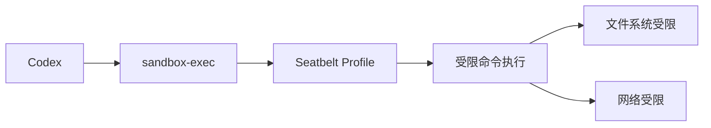
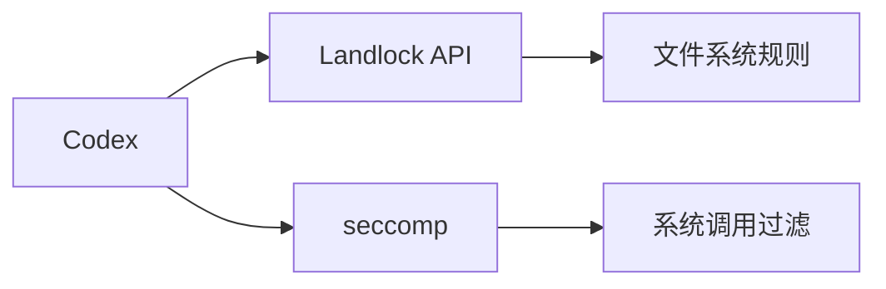

# OS 级沙箱与命令执行安全

> 来源: Codex CLI
> 优先级: 🔴 高

## 概述

Codex CLI 实现了完整的 OS 级沙箱机制，在执行模型生成的 shell 命令前，通过操作系统原生的安全特性限制命令的文件系统访问和网络访问能力。

## Codex 实现分析

### 平台特定实现

#### macOS: Apple Seatbelt



- 使用 `sandbox-exec` 命令和 Seatbelt profile
- 支持 `read-only` 和 `workspace-write` 模式
- 可配置网络访问权限

#### Linux: Landlock + seccomp



- 使用 Linux 5.13+ 的 Landlock LSM
- 结合 seccomp 进行系统调用过滤
- 内核版本不支持时优雅降级

#### Windows: RestrictedToken + AppContainer

- 实验性支持
- 使用 AppContainer 受限令牌
- 通过环境变量和 stub 可执行文件阻止网络访问

### 沙箱模式

| 模式 | 说明 | 用例 |
|------|------|------|
| `read-only` | 只读文件系统，无网络 | 代码分析、问答 |
| `workspace-write` | 工作区可写，临时目录可写 | 代码编辑、测试 |
| `danger-full-access` | 无限制 | Docker 内部使用 |

### 配置示例

```toml
# config.toml
sandbox_mode = "workspace-write"

[sandbox_workspace_write]
exclude_tmpdir_env_var = false
exclude_slash_tmp = false
writable_roots = ["/Users/YOU/.pyenv/shims"]
network_access = false
```

## 借鉴价值

### 对 Crush 的好处

1. **安全性提升**：防止模型生成的恶意命令损坏文件系统
2. **用户信任**：提供可审计的安全保证
3. **渐进式权限**：用户可逐步授予更多权限
4. **容器化支持**：在已有的 Docker 环境中可禁用额外沙箱

### 实现建议

#### Phase 1: macOS Seatbelt 支持

```go
// internal/sandbox/seatbelt.go
package sandbox

import (
    "os/exec"
)

type SeatbeltSandbox struct {
    profile     string
    writableRoots []string
    networkAccess bool
}

func (s *SeatbeltSandbox) Wrap(cmd *exec.Cmd) *exec.Cmd {
    args := []string{"-f", s.profile, cmd.Path}
    args = append(args, cmd.Args[1:]...)
    
    sandboxed := exec.Command("/usr/bin/sandbox-exec", args...)
    sandboxed.Dir = cmd.Dir
    sandboxed.Env = cmd.Env
    return sandboxed
}
```

#### Phase 2: Linux Landlock 支持

```go
// internal/sandbox/landlock.go
package sandbox

// 使用 github.com/landlock-lsm/go-landlock
import (
    "github.com/landlock-lsm/go-landlock/landlock"
)

func RestrictFilesystem(readOnlyPaths, readWritePaths []string) error {
    // Landlock 配置
    return landlock.V1.BestEffort().RestrictPaths(
        // ... 路径规则
    )
}
```

#### 配置扩展

```go
// internal/config/config.go
type SandboxConfig struct {
    Mode            string   `json:"sandbox_mode"`           // read-only, workspace-write, danger-full-access
    WritableRoots   []string `json:"writable_roots"`
    NetworkAccess   bool     `json:"network_access"`
    ExcludeTmpdir   bool     `json:"exclude_tmpdir"`
}
```

### 用户界面

在权限请求对话框中添加沙箱信息：

```
┌─────────────────────────────────────────────────────┐
│ 🔒 Sandboxed Command Execution                      │
├─────────────────────────────────────────────────────┤
│ Command: npm install                                │
│ Mode: workspace-write                               │
│ Writable: /Users/user/project                       │
│ Network: disabled                                   │
├─────────────────────────────────────────────────────┤
│ [Allow] [Allow for Session] [Deny] [Full Access]    │
└─────────────────────────────────────────────────────┘
```

## 实施计划

| 阶段 | 任务 | 工作量 |
|------|------|--------|
| 1 | macOS Seatbelt 集成 | 3-5 天 |
| 2 | Linux Landlock 集成 | 3-5 天 |
| 3 | 配置系统扩展 | 2-3 天 |
| 4 | TUI 权限对话框更新 | 2-3 天 |
| 5 | 文档和测试 | 2 天 |

**总计**: 约 12-18 天

## 风险与缓解

| 风险 | 缓解措施 |
|------|----------|
| 内核版本不支持 Landlock | 优雅降级，记录警告 |
| Seatbelt profile 不正确 | 提供调试命令 `crush sandbox test` |
| 影响正常命令执行 | 默认 workspace-write 模式 |
| Windows 支持复杂 | 暂不优先，标记为实验性 |

## 参考资料

- [Codex sandbox.md](https://github.com/openai/codex/blob/main/docs/sandbox.md)
- [Apple Sandbox Guide](https://developer.apple.com/library/archive/documentation/Security/Conceptual/AppSandboxDesignGuide/)
- [Landlock Documentation](https://www.kernel.org/doc/html/latest/userspace-api/landlock.html)
- [go-landlock Library](https://github.com/landlock-lsm/go-landlock)

---

*此功能是 Codex 最核心的安全特性之一，强烈建议 Crush 优先实现。*
