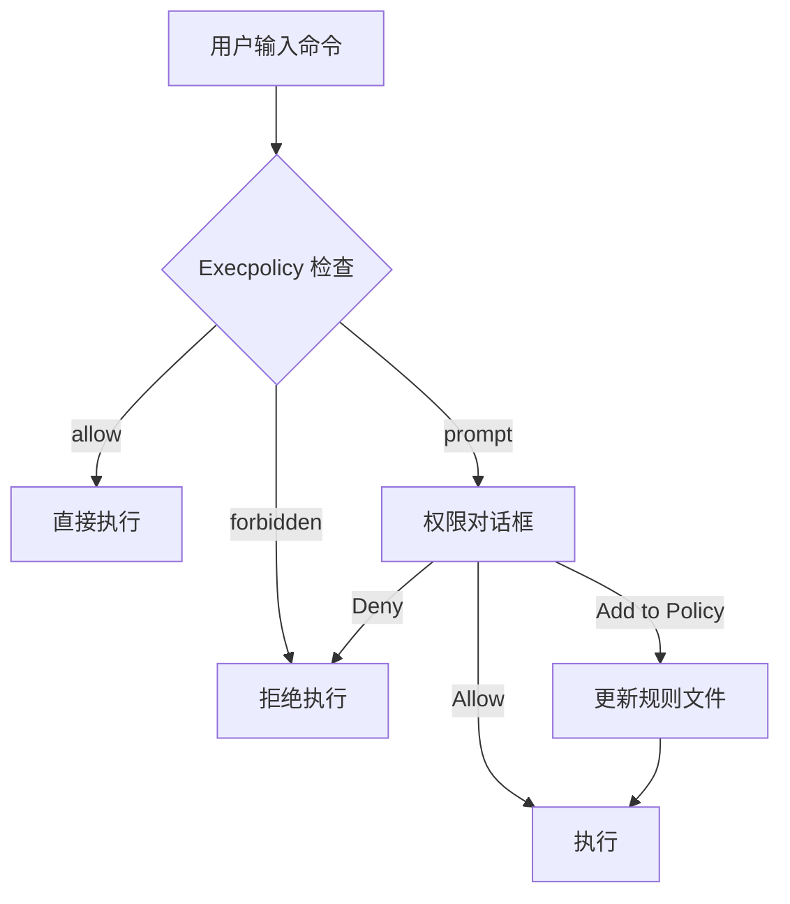

# Execpolicy 自定义命令规则系统

> 来源: Codex CLI
> 优先级: 🔴 高

## 概述

Codex 的 `execpolicy` 系统允许用户定义自己的规则来控制哪些 shell 命令可以自动执行、需要提示确认、或完全禁止。这提供了比简单的"允许/拒绝"更精细的控制。

## Codex 实现分析

### 规则文件位置

```
~/.codex/policy/
├── default.execpolicy    # 用户通过 TUI 添加的白名单
├── project.execpolicy    # 项目级规则
└── custom.execpolicy     # 自定义规则
```

### 规则语法 (Starlark)

```starlark
# ~/.codex/policy/default.execpolicy

# 允许 git 只读操作
prefix_rule(
    pattern = ["git", ["status", "log", "diff", "show", "branch"]],
    decision = "allow",
)

# 需要确认的 git 写操作
prefix_rule(
    pattern = ["git", ["push", "fetch", "pull"]],
    decision = "prompt",
    match = [["git", "push", "origin", "main"]],
    not_match = [["git", "status"]],
)

# 禁止危险操作
prefix_rule(
    pattern = ["rm", "-rf"],
    decision = "forbidden",
)

# 允许包管理器只读操作
prefix_rule(
    pattern = ["npm", ["list", "ls", "outdated", "audit"]],
    decision = "allow",
)
```

### 规则优先级

决策优先级（从高到低）：

1. `forbidden` - 完全禁止
2. `prompt` - 需要用户确认
3. `allow` - 自动允许

当多条规则匹配同一命令时，采用最严格的决策。

### TUI 集成

Codex 在命令提示时提供"加入白名单"选项：

```
┌─────────────────────────────────────────────────────┐
│ Execute command?                                    │
├─────────────────────────────────────────────────────┤
│ git push origin main                                │
├─────────────────────────────────────────────────────┤
│ [y] Yes  [n] No  [a] Add to allowlist               │
└─────────────────────────────────────────────────────┘
```

选择 `[a]` 后自动写入 `~/.codex/policy/default.execpolicy`。

### 验证工具

```bash
# 预览规则决策
codex execpolicy check --policy ~/.codex/policy/default.execpolicy git push origin main

# 输出
{
  "matchedRules": [
    {
      "prefixRuleMatch": {
        "matchedPrefix": ["git", "push"],
        "decision": "prompt"
      }
    }
  ],
  "decision": "prompt"
}
```

## 借鉴价值

### 对 Crush 的好处

1. **精细控制**：超越简单的"yolo"模式，给用户更多控制权
2. **安全默认**：危险命令需要额外确认
3. **学习曲线低**：TUI 辅助建立规则库
4. **可移植**：规则文件可在团队间共享

### 实现建议

#### 规则结构 (Go)

```go
// internal/execpolicy/policy.go
package execpolicy

type Decision string

const (
    DecisionAllow     Decision = "allow"
    DecisionPrompt    Decision = "prompt"
    DecisionForbidden Decision = "forbidden"
)

type PrefixRule struct {
    Pattern   []interface{} `json:"pattern"`   // 可以是字符串或字符串数组
    Decision  Decision      `json:"decision"`
    Match     [][]string    `json:"match"`     // 必须匹配的示例
    NotMatch  [][]string    `json:"not_match"` // 不能匹配的示例
}

type Policy struct {
    Rules []PrefixRule `json:"rules"`
}

func (p *Policy) Check(command []string) Decision {
    var strictest Decision = DecisionAllow
    
    for _, rule := range p.Rules {
        if rule.Matches(command) {
            strictest = mostStrict(strictest, rule.Decision)
        }
    }
    
    return strictest
}
```

#### 规则文件格式 (JSON)

考虑到 Go 生态和 Crush 现有的 JSON 配置风格，建议使用 JSON 而非 Starlark：

```json
// ~/.crush/policy/default.json
{
  "rules": [
    {
      "pattern": ["git", ["status", "log", "diff", "show"]],
      "decision": "allow"
    },
    {
      "pattern": ["git", ["push", "fetch", "pull"]],
      "decision": "prompt"
    },
    {
      "pattern": ["rm", "-rf"],
      "decision": "forbidden"
    }
  ]
}
```

#### TUI 集成

在现有权限对话框中增加选项：

```go
// internal/tui/components/dialogs/permission.go

const (
    OptionAllow        = "Allow"
    OptionDeny         = "Deny"
    OptionAllowSession = "Allow for Session"
    OptionAddToPolicy  = "Add to Policy"  // 新增
)

func (d *PermissionDialog) handleAddToPolicy(command []string) error {
    rule := execpolicy.PrefixRule{
        Pattern:  suggestPattern(command),
        Decision: execpolicy.DecisionAllow,
    }
    return d.policyManager.AddRule(rule)
}
```

#### Slash 命令

```bash
# 查看当前规则
/policy list

# 检查命令决策
/policy check "git push origin main"

# 添加规则
/policy add --pattern "npm test" --decision allow

# 删除规则
/policy remove <rule-id>
```

### 预设规则库

提供常见工具的预设规则：

```json
// ~/.crush/policy/presets/development.json
{
  "name": "Development",
  "description": "Safe defaults for development workflows",
  "rules": [
    {"pattern": ["git", ["status", "log", "diff", "show", "branch"]], "decision": "allow"},
    {"pattern": ["npm", ["list", "ls", "outdated", "run", "test"]], "decision": "allow"},
    {"pattern": ["go", ["build", "test", "mod", "fmt", "vet"]], "decision": "allow"},
    {"pattern": ["cargo", ["build", "test", "check", "fmt", "clippy"]], "decision": "allow"},
    {"pattern": ["make"], "decision": "allow"},
    {"pattern": ["cat"], "decision": "allow"},
    {"pattern": ["ls"], "decision": "allow"},
    {"pattern": ["head"], "decision": "allow"},
    {"pattern": ["tail"], "decision": "allow"},
    {"pattern": ["grep"], "decision": "allow"},
    {"pattern": ["find"], "decision": "allow"},
    {"pattern": ["rm", "-rf"], "decision": "forbidden"},
    {"pattern": ["sudo"], "decision": "prompt"},
    {"pattern": ["curl"], "decision": "prompt"},
    {"pattern": ["wget"], "decision": "prompt"}
  ]
}
```

## 实施计划

| 阶段 | 任务 | 工作量 |
|------|------|--------|
| 1 | 规则引擎实现 | 2-3 天 |
| 2 | 规则文件加载/保存 | 1-2 天 |
| 3 | 与权限系统集成 | 2-3 天 |
| 4 | TUI "Add to Policy" 选项 | 1-2 天 |
| 5 | Slash 命令实现 | 1-2 天 |
| 6 | 预设规则库 | 1 天 |
| 7 | 文档和测试 | 2 天 |

**总计**: 约 10-15 天

## 与现有系统的整合



## 参考资料

- [Codex execpolicy.md](https://github.com/openai/codex/blob/main/docs/execpolicy.md)
- [Starlark Language](https://github.com/google/starlark-go)

---

*Execpolicy 是 Codex 控制命令执行的核心机制，建议 Crush 用 JSON 格式实现类似功能。*
