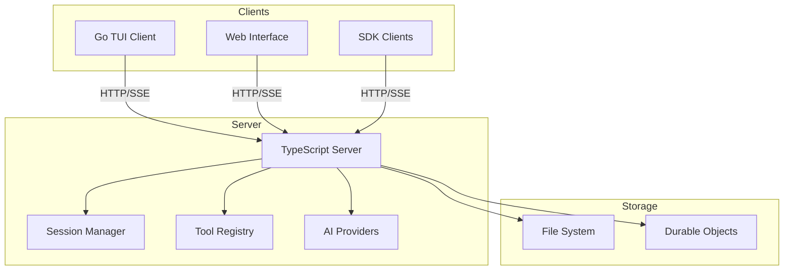
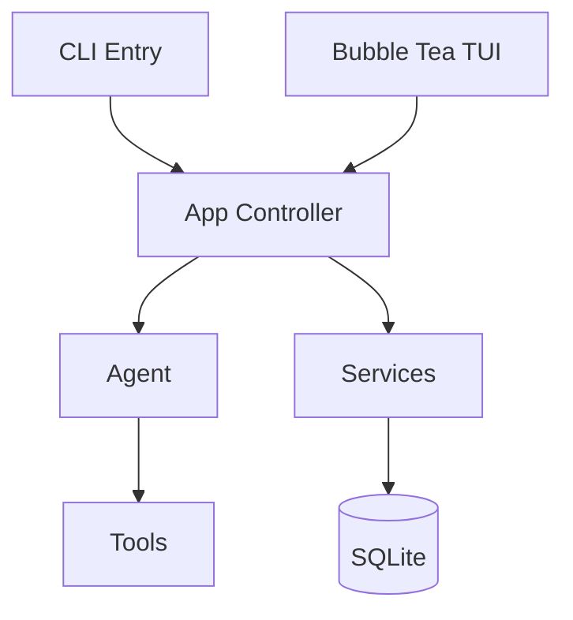

# Client-Server 分离架构

> 来源: OpenCode
> 优先级: 🟢 低

## 概述

OpenCode 采用 Client-Server 分离架构：TypeScript 服务端处理业务逻辑，Go TUI 作为客户端通过 HTTP/SSE 通信。这种架构增加了灵活性但也增加了复杂度。

## OpenCode 架构分析

### 组件分布



### 通信协议

**HTTP API**：RESTful 风格

```
POST /sessions          # 创建会话
GET  /sessions/{id}     # 获取会话
POST /messages          # 发送消息
GET  /event             # SSE 事件流
```

**SSE 事件流**：实时更新

```javascript
// 客户端订阅
const eventSource = new EventSource('/event');
eventSource.onmessage = (event) => {
    const data = JSON.parse(event.data);
    // 处理事件：text_delta, tool_call, etc.
};
```

### 优点

1. **多客户端支持**：TUI、Web、Mobile 共用后端
2. **远程控制**：可以远程驱动 Agent
3. **水平扩展**：服务端可独立扩展
4. **技术栈灵活**：各端可用最适合的语言

### 缺点

1. **复杂度增加**：需要维护 API 契约
2. **延迟增加**：网络通信开销
3. **部署复杂**：需要管理多个进程
4. **调试困难**：分布式系统调试更难

## Crush 现状分析

### 当前架构



**特点**：

- 单进程，紧密耦合
- SQLite 本地存储
- Bubble Tea 原生 TUI
- 无网络 API

### 优势

1. **简单可靠**：无分布式复杂性
2. **零配置**：开箱即用
3. **离线友好**：不依赖网络服务
4. **快速启动**：无服务器启动延迟

## 是否需要 Client-Server？

### 现阶段：不需要

Crush 作为"编程助手"的定位，单进程架构更适合：

| 需求 | 当前方案 | 足够？ |
|------|----------|--------|
| 终端使用 | Bubble Tea | ✅ |
| 会话持久化 | SQLite | ✅ |
| 多模型支持 | 进程内切换 | ✅ |
| 工具执行 | 本地进程 | ✅ |
| 集成需求 | MCP Server | ✅ |

### 未来可能需要的场景

1. **移动端控制**：手机上驱动桌面 Crush
2. **Web 界面**：不用终端的 Web 版本
3. **团队共享**：共享 Agent 能力
4. **云托管**：Crush as a Service

## 如果需要，如何演进

### 渐进式方案

不需要一步到位，可以分阶段：

#### Phase 1: 内部 API 抽象

```go
// internal/api/api.go
package api

type API interface {
    CreateSession(ctx context.Context, req CreateSessionRequest) (*Session, error)
    SendMessage(ctx context.Context, sessionID string, content string) (*Message, error)
    ListTools(ctx context.Context) ([]Tool, error)
    // ...
}

// 本地实现
type LocalAPI struct {
    app *app.App
}

func (a *LocalAPI) CreateSession(ctx context.Context, req CreateSessionRequest) (*Session, error) {
    return a.app.SessionService.Create(ctx, req)
}
```

#### Phase 2: HTTP Wrapper（可选）

```go
// internal/server/http.go
package server

func NewHTTPServer(api api.API) *http.Server {
    mux := http.NewServeMux()
    
    mux.HandleFunc("POST /sessions", func(w http.ResponseWriter, r *http.Request) {
        var req CreateSessionRequest
        json.NewDecoder(r.Body).Decode(&req)
        session, _ := api.CreateSession(r.Context(), req)
        json.NewEncoder(w).Encode(session)
    })
    
    // SSE endpoint
    mux.HandleFunc("GET /events", sseHandler(api))
    
    return &http.Server{Handler: mux}
}
```

#### Phase 3: TUI 客户端化（可选）

```go
// internal/tui/client_mode.go
package tui

type ClientMode struct {
    api    api.API        // 可以是 LocalAPI 或 RemoteAPI
    events <-chan Event
}

func NewClientMode(serverURL string) (*ClientMode, error) {
    if serverURL == "" {
        // 本地模式
        app := app.New()
        return &ClientMode{api: &LocalAPI{app: app}}, nil
    }
    // 远程模式
    return &ClientMode{api: &RemoteAPI{baseURL: serverURL}}, nil
}
```

### 配置选项

```json
{
  "server": {
    "enabled": false,
    "listen": "127.0.0.1:8765"
  },
  "client": {
    "server_url": ""  // 空 = 本地模式
  }
}
```

```bash
# 启动服务器模式
crush serve --listen 127.0.0.1:8765

# 连接到远程
crush --server http://192.168.1.100:8765
```

## 工作量估算

| 阶段 | 工作量 | 价值 |
|------|--------|------|
| API 抽象层 | 3-5 天 | 代码解耦 |
| HTTP Server | 5-8 天 | 远程访问 |
| SSE 事件流 | 3-5 天 | 实时更新 |
| TUI 客户端模式 | 5-8 天 | 远程 TUI |
| Web 界面 | 10-15 天 | 浏览器使用 |
| 认证/授权 | 5-8 天 | 多用户安全 |

**完整 Client-Server 总计**: 约 30-50 天

## 建议

### 短期

**保持单进程架构**：

- 专注核心功能（沙箱、规则、提示词）
- 通过 MCP Server Mode 满足集成需求
- 保持简单可靠的用户体验

### 中期

**API 抽象重构**：

- 为未来演进打基础
- 不对外暴露 HTTP
- 提高代码可测试性

### 长期（根据需求）

**按需添加服务端模式**：

- 如果用户有远程控制需求
- 如果需要 Web 界面
- 如果需要多用户/团队功能

## 参考资料

- [OpenCode Architecture](https://github.com/sst/opencode/tree/main/packages)
- [SSE Specification](https://html.spec.whatwg.org/multipage/server-sent-events.html)

---

*Client-Server 架构是一个重大架构决策，目前不建议 Crush 采用。单进程架构更符合其"终端友好"的定位。*
