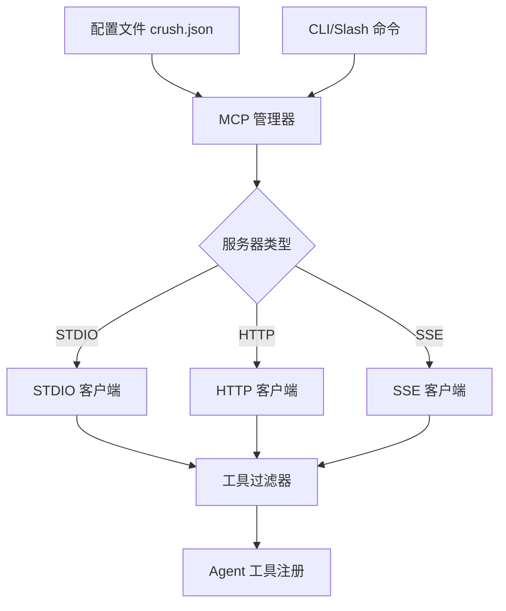

# 插件系统与扩展机制

> 来源: OpenCode, Codex CLI
> 优先级: 🟡 中

## 概述

OpenCode 和 Codex 都支持通过 MCP (Model Context Protocol) 和插件系统扩展功能。Crush 已有基础 MCP 支持，但可以借鉴更多扩展机制。

## 现有实现分析

### OpenCode 插件系统与 MCP 管理

OpenCode 支持 JavaScript 插件：

```typescript
// ~/.opencode/plugins/my-plugin.js
export default async function plugin(input) {
  const { client, project, directory, Tool, z } = input;
  
  // 定义自定义工具
  const myTool = Tool.define("my-custom-tool", {
    description: "A custom tool",
    parameters: z.object({
      query: z.string(),
    }),
    execute: async (args, ctx) => {
      // 工具逻辑
      return { title: "Result", output: "Done!" };
    },
  });
  
  return {
    tools: [myTool],
  };
}
```

**插件能力**：

- 定义新工具
- 访问文件系统
- 调用 shell
- 与 AI 模型交互

**MCP 管理 & OAuth**：

- CLI: `opencode mcp list/add/auth/logout`（见 `packages/opencode/src/cli/cmd/mcp.ts`）  
- 远程 MCP OAuth：流式 HTTP/SSE 客户端支持 OAuth code flow，凭证保存在 `mcp-auth.json`（`packages/opencode/src/mcp/*.ts`）。

### Codex MCP 集成

Codex 深度集成 MCP：

```toml
# ~/.codex/config.toml

# STDIO 类型 MCP 服务器
[mcp_servers.docs]
command = "npx"
args = ["-y", "docs-server"]
env = { "API_KEY" = "value" }

# HTTP 类型 MCP 服务器
[mcp_servers.figma]
url = "https://mcp.figma.com/mcp"
bearer_token_env_var = "FIGMA_TOKEN"
```

**MCP CLI 命令**：

```bash
codex mcp add <name> -- <command>
codex mcp list
codex mcp get <name>
codex mcp remove <name>
codex mcp login <server>   # OAuth 支持
```

## Crush 现状

### 已有 MCP 支持

Crush 已支持 MCP 配置：

```json
// crush.json
{
  "mcp_servers": {
    "weather": {
      "type": "stdio",
      "command": ["npx", "-y", "@h1deya/mcp-server-weather"]
    }
  }
}
```

### 缺失功能

| 功能 | Codex | OpenCode | Crush |
|------|-------|----------|-------|
| MCP STDIO | ✅ | ✅ | ✅ |
| MCP HTTP | ✅ | ✅ | ⚠️ 部分 |
| MCP SSE | ✅ | ✅ | ⚠️ 部分 |
| MCP CLI 管理 | ✅ | ✅ | ❌ |
| MCP OAuth | ✅ | ✅ | ❌ |
| JS 插件 | ❌ | ✅ | ❌ |
| 工具启用/禁用 | ✅ | ❌ | ❌ |
| 服务器超时配置 | ✅ | ❌ | ❌ |

## 借鉴建议

### 1. MCP CLI 管理命令

添加 MCP 服务器管理的 slash 命令和 CLI：

```bash
# CLI
crush mcp add docs -- npx -y docs-server
crush mcp list
crush mcp remove docs

# Slash 命令
/mcp list
/mcp add docs -- npx -y docs-server
/mcp test docs  # 测试连接
```

**实现**：

```go
// internal/cmd/mcp.go
package cmd

var mcpCmd = &cobra.Command{
    Use:   "mcp",
    Short: "Manage MCP servers",
}

var mcpAddCmd = &cobra.Command{
    Use:   "add <name> -- <command>...",
    Short: "Add an MCP server",
    RunE: func(cmd *cobra.Command, args []string) error {
        name := args[0]
        command := args[1:]  // after --
        
        cfg, _ := config.Load()
        cfg.MCPServers[name] = config.MCPServer{
            Type:    "stdio",
            Command: command,
        }
        return config.Save(cfg)
    },
}

var mcpListCmd = &cobra.Command{
    Use:   "list",
    Short: "List configured MCP servers",
    RunE: func(cmd *cobra.Command, args []string) error {
        cfg, _ := config.Load()
        for name, server := range cfg.MCPServers {
            fmt.Printf("%s: %s %v\n", name, server.Type, server.Command)
        }
        return nil
    },
}
```

### 2. 工具选择性启用/禁用

```json
// crush.json
{
  "mcp_servers": {
    "weather": {
      "command": ["npx", "-y", "weather-server"],
      "enabled": true,
      "enabled_tools": ["get_weather", "get_forecast"],
      "disabled_tools": ["set_location"]
    }
  }
}
```

**实现**：

```go
// internal/mcp/filter.go
package mcp

func FilterTools(server *MCPServer, tools []Tool) []Tool {
    if !server.Enabled {
        return nil
    }
    
    var result []Tool
    for _, tool := range tools {
        // 检查启用列表
        if len(server.EnabledTools) > 0 {
            if !contains(server.EnabledTools, tool.Name) {
                continue
            }
        }
        // 检查禁用列表
        if contains(server.DisabledTools, tool.Name) {
            continue
        }
        result = append(result, tool)
    }
    return result
}
```

### 3. 服务器超时配置

```json
{
  "mcp_servers": {
    "slow-server": {
      "command": ["slow-mcp-server"],
      "startup_timeout_sec": 30,
      "tool_timeout_sec": 120
    }
  }
}
```

### 4. HTTP/SSE MCP 增强

```json
{
  "mcp_servers": {
    "remote-api": {
      "type": "http",
      "url": "https://api.example.com/mcp",
      "headers": {
        "X-API-Key": "${API_KEY}"
      },
      "bearer_token_env_var": "BEARER_TOKEN"
    }
  }
}
```

### 5. 插件目录支持（未来）

考虑未来支持 Go 插件或 WASM 插件：

```
~/.crush/plugins/
├── code-review/
│   ├── plugin.json
│   └── main.wasm
└── custom-tool/
    ├── plugin.json
    └── main.wasm
```

**插件定义**：

```json
// plugin.json
{
  "name": "code-review",
  "version": "1.0.0",
  "description": "AI-powered code review assistant",
  "entry": "main.wasm",
  "tools": [
    {
      "name": "review_code",
      "description": "Review code for issues"
    }
  ]
}
```

## 实施计划

### Phase 1: MCP 管理增强（优先）

| 任务 | 工作量 |
|------|--------|
| MCP CLI 命令 (add/list/remove) | 2 天 |
| MCP Slash 命令 | 1 天 |
| 工具启用/禁用过滤 | 1 天 |
| 超时配置 | 0.5 天 |

**小计**: 约 4-5 天

### Phase 2: HTTP MCP 增强

| 任务 | 工作量 |
|------|--------|
| HTTP 认证头支持 | 1 天 |
| 环境变量替换 | 0.5 天 |
| Bearer token 支持 | 0.5 天 |

**小计**: 约 2 天

### Phase 3: 高级功能（可选）

| 任务 | 工作量 |
|------|--------|
| MCP OAuth 登录流程 | 3-5 天 |
| WASM 插件基础设施 | 10-15 天 |
| 插件市场集成 | 5-8 天 |

## 与现有 MCP 实现的整合



## 参考资料

- [Codex MCP Configuration](https://github.com/openai/codex/blob/main/docs/config.md#mcp_servers)
- [OpenCode Plugin System](https://github.com/sst/opencode/tree/main/packages/plugin)
- [Model Context Protocol](https://modelcontextprotocol.io/)
- [MCP Servers List](https://github.com/modelcontextprotocol/servers)

---

*MCP 管理增强是相对低成本高价值的改进，建议在稳定版后优先实现。*
