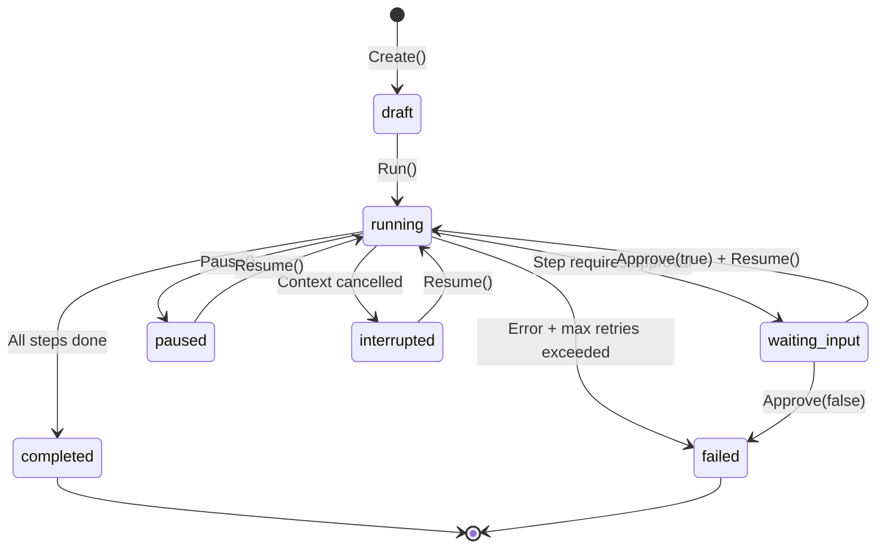

# Workflow Engine Implementation

> **Version**: 1.0  
> **Date**: 2025-12-13  
> **Status**: Implemented (v1 Sequential)

---

## 1. Overview

Workflow Engine 是 Crush 编排系统的核心组件，提供状态机驱动的多步骤工作流执行能力。v1 版本实现顺序工作流，支持审批门控、暂停恢复和重试逻辑。

### 1.1 设计目标

- **状态机驱动**: 工作流和步骤具有明确的生命周期状态
- **持久化恢复**: 所有状态写入数据库，支持中断恢复
- **审批门控**: 关键步骤可配置审批要求
- **事件广播**: 所有状态变更通过 PubSub 广播
- **Subagent 集成**: 通过 Registry 调度 Claude Code / Codex

---

## 2. 代码结构

```
internal/
├── workflow/
│   ├── types.go          # 状态枚举、领域模型、DB 转换
│   ├── engine.go         # 状态机、步骤执行、审批处理
│   ├── types_test.go     # 类型单元测试
│   └── engine_test.go    # 引擎单元测试
├── db/
│   ├── migrations/
│   │   └── 20251213000000_add_workflows.sql  # Goose 迁移
│   ├── sql/
│   │   └── workflows.sql  # SQLC 查询定义
│   ├── workflows.sql.go   # 生成的 Go 绑定
│   └── models.go          # Workflow/WorkflowStep 模型
└── pubsub/
    └── events.go          # 扩展的事件类型
```

---

## 3. 数据模型

### 3.1 状态枚举

#### WorkflowState

| 状态 | 值 | 说明 |
|------|-----|------|
| Draft | `draft` | 初始化，未开始 |
| Running | `running` | 正在执行 |
| WaitingInput | `waiting_input` | 等待用户输入/审批 |
| Paused | `paused` | 用户主动暂停 |
| Completed | `completed` | 成功完成 |
| Failed | `failed` | 失败终止 |
| Interrupted | `interrupted` | 中断（进程退出/崩溃） |

**代码位置**: [`internal/workflow/types.go:14-23`](file:///Users/mxue/GitRepos/Coding/crush/internal/workflow/types.go#L14-23)

#### StepStatus

| 状态 | 值 | 说明 |
|------|-----|------|
| Pending | `pending` | 未开始 |
| Running | `running` | 执行中 |
| Completed | `completed` | 完成 |
| Failed | `failed` | 失败 |
| Skipped | `skipped` | 跳过 |
| Waiting | `waiting` | 等待审批 |

**代码位置**: [`internal/workflow/types.go:26-35`](file:///Users/mxue/GitRepos/Coding/crush/internal/workflow/types.go#L26-35)

#### ApprovalStatus

| 状态 | 值 | 说明 |
|------|-----|------|
| Pending | `pending` | 待审批 |
| Approved | `approved` | 已批准 |
| Rejected | `rejected` | 已拒绝 |

**代码位置**: [`internal/workflow/types.go:38-44`](file:///Users/mxue/GitRepos/Coding/crush/internal/workflow/types.go#L38-44)

### 3.2 数据库表

#### workflows 表

```sql
CREATE TABLE workflows (
    id TEXT PRIMARY KEY,
    parent_session_id TEXT REFERENCES sessions(id),
    title TEXT NOT NULL,
    state TEXT NOT NULL DEFAULT 'draft',
    plan_json TEXT,
    config_json TEXT,
    current_step_index INTEGER NOT NULL DEFAULT 0,
    error_message TEXT,
    created_at INTEGER NOT NULL,
    updated_at INTEGER NOT NULL,
    completed_at INTEGER
);
```

#### workflow_steps 表

```sql
CREATE TABLE workflow_steps (
    id TEXT PRIMARY KEY,
    workflow_id TEXT NOT NULL REFERENCES workflows(id) ON DELETE CASCADE,
    step_index INTEGER NOT NULL,
    step_type TEXT NOT NULL,        -- 'plan', 'code', 'review', 'docs'
    agent TEXT NOT NULL,            -- 'claude-code', 'codex'
    agent_session_id TEXT,          -- Resume token
    status TEXT NOT NULL DEFAULT 'pending',
    title TEXT,
    input_context_json TEXT,
    output_json TEXT,
    review_result_json TEXT,
    retry_count INTEGER NOT NULL DEFAULT 0,
    max_retries INTEGER NOT NULL DEFAULT 3,
    requires_approval INTEGER NOT NULL DEFAULT 0,
    approval_status TEXT,
    error_message TEXT,
    created_at INTEGER NOT NULL,
    started_at INTEGER,
    completed_at INTEGER,
    UNIQUE(workflow_id, step_index)
);
```

**迁移文件**: [`internal/db/migrations/20251213000000_add_workflows.sql`](file:///Users/mxue/GitRepos/Coding/crush/internal/db/migrations/20251213000000_add_workflows.sql)

---

## 4. Engine API

### 4.1 核心接口

```go
type Engine struct {
    queries  *db.Queries
    registry *subagent.Registry
    events   *pubsub.Broker[WorkflowEvent]
}

// 创建工作流
func (e *Engine) Create(ctx context.Context, opts CreateOptions) (*Workflow, error)

// 运行工作流（从 draft/paused/interrupted 状态启动）
func (e *Engine) Run(ctx context.Context, workflowID string) error

// 暂停运行中的工作流
func (e *Engine) Pause(ctx context.Context, workflowID string) error

// 恢复暂停的工作流
func (e *Engine) Resume(ctx context.Context, workflowID string) error

// 审批步骤
func (e *Engine) Approve(ctx context.Context, stepID string, approved bool) error

// 取消工作流
func (e *Engine) Cancel(ctx context.Context, workflowID string) error

// 获取工作流状态
func (e *Engine) GetWorkflow(ctx context.Context, workflowID string) (*Workflow, error)

// 获取工作流步骤
func (e *Engine) GetSteps(ctx context.Context, workflowID string) ([]Step, error)

// 列出所有工作流
func (e *Engine) ListWorkflows(ctx context.Context) ([]Workflow, error)

// 获取事件 Broker 用于订阅
func (e *Engine) Events() *pubsub.Broker[WorkflowEvent]
```

**代码位置**: [`internal/workflow/engine.go`](file:///Users/mxue/GitRepos/Coding/crush/internal/workflow/engine.go)

### 4.2 CreateOptions

```go
type CreateOptions struct {
    Title           string
    ParentSessionID string
    Config          WorkflowConfig
}

type WorkflowConfig struct {
    Title   string       `json:"title"`
    Plan    string       `json:"plan"`
    Steps   []StepConfig `json:"steps"`
    Context interface{}  `json:"context,omitempty"`
}

type StepConfig struct {
    StepType         StepType `json:"step_type"`
    Agent            string   `json:"agent"`
    Title            string   `json:"title"`
    RequiresApproval bool     `json:"requires_approval"`
    MaxRetries       int      `json:"max_retries"`
}
```

---

## 5. 状态机

### 5.1 状态转换图



### 5.2 执行循环

```go
func (e *Engine) runLoop(ctx context.Context, workflowID string) error {
    for {
        // 1. 检查 context 取消 → interrupted
        // 2. 获取当前步骤 (current_step_index)
        // 3. 如果无更多步骤 → completed
        // 4. 检查步骤是否需要审批且正在等待
        //    - 未审批 → waiting_input, 返回 ErrApprovalRequired
        //    - 已拒绝 → failed
        // 5. 执行步骤 (dispatchToSubagent)
        // 6. 失败时检查重试次数
        //    - 可重试 → increment retry_count, continue
        //    - 不可重试 → failed
        // 7. 成功 → 推进 current_step_index
    }
}
```

**代码位置**: [`internal/workflow/engine.go:154-211`](file:///Users/mxue/GitRepos/Coding/crush/internal/workflow/engine.go#L154-211)

---

## 6. 默认工作流

```go
func DefaultWorkflowConfig(title, plan string) WorkflowConfig {
    return WorkflowConfig{
        Title: title,
        Plan:  plan,
        Steps: []StepConfig{
            {StepType: StepTypePlan, Agent: "claude-code", Title: "Planning", RequiresApproval: false, MaxRetries: 1},
            {StepType: StepTypeReview, Agent: "codex", Title: "Plan Review", RequiresApproval: true, MaxRetries: 1},
            {StepType: StepTypeCode, Agent: "claude-code", Title: "Coding", RequiresApproval: false, MaxRetries: 2},
            {StepType: StepTypeReview, Agent: "codex", Title: "Feature Review", RequiresApproval: false, MaxRetries: 1},
            {StepType: StepTypeReview, Agent: "codex", Title: "Final Review", RequiresApproval: false, MaxRetries: 1},
            {StepType: StepTypeDocs, Agent: "claude-code", Title: "Documentation", RequiresApproval: false, MaxRetries: 1},
        },
    }
}
```

| 步骤 | Agent | 类型 | 需要审批 | 最大重试 |
|------|-------|------|---------|---------|
| Planning | claude-code | plan | ❌ | 1 |
| Plan Review | codex | review | ✅ | 1 |
| Coding | claude-code | code | ❌ | 2 |
| Feature Review | codex | review | ❌ | 1 |
| Final Review | codex | review | ❌ | 1 |
| Documentation | claude-code | docs | ❌ | 1 |

**代码位置**: [`internal/workflow/types.go:104-117`](file:///Users/mxue/GitRepos/Coding/crush/internal/workflow/types.go#L104-117)

---

## 7. PubSub 事件

### 7.1 事件类型

| 事件 | 常量 | 触发时机 |
|------|------|---------|
| Workflow Started | `workflow_started` | Run() 启动 |
| Workflow Paused | `workflow_paused` | Pause() 调用 |
| Workflow Resumed | `workflow_resumed` | Resume() 调用 |
| Workflow Completed | `workflow_completed` | 所有步骤完成 |
| Workflow Failed | `workflow_failed` | 失败终止 |
| Step Started | `step_started` | 步骤开始执行 |
| Step Completed | `step_completed` | 步骤成功完成 |
| Step Failed | `step_failed` | 步骤执行失败 |
| Step Waiting | `step_waiting` | 步骤等待审批 |
| Approval Requested | `approval_requested` | 请求审批 |
| Approval Granted | `approval_granted` | 审批通过 |
| Approval Denied | `approval_denied` | 审批拒绝 |

**代码位置**: [`internal/pubsub/events.go:11-26`](file:///Users/mxue/GitRepos/Coding/crush/internal/pubsub/events.go#L11-26)

### 7.2 事件结构

```go
type WorkflowEvent struct {
    WorkflowID string
    StepID     string
    StepIndex  int
    EventType  pubsub.EventType
    State      WorkflowState
    StepStatus StepStatus
    Error      string
}
```

### 7.3 订阅示例

```go
ctx, cancel := context.WithCancel(context.Background())
defer cancel()

events := engine.Events().Subscribe(ctx)
for event := range events {
    switch event.Type {
    case pubsub.WorkflowCompletedEvent:
        fmt.Printf("Workflow %s completed\n", event.Payload.WorkflowID)
    case pubsub.StepWaitingEvent:
        fmt.Printf("Step %d waiting for approval\n", event.Payload.StepIndex)
    }
}
```

---

## 8. Subagent 集成

### 8.1 调度流程

```go
func (e *Engine) dispatchToSubagent(ctx context.Context, step db.WorkflowStep) (*subagent.Result, error) {
    // 1. 从 Registry 解析 agent
    reg, err := e.registry.Resolve(step.Agent)
    
    // 2. 构建请求
    req := subagent.Request{
        Task:    step.Title.String,
        Sandbox: subagent.SandboxReadOnly,
        Profile: &reg.Profile,
    }
    
    // 3. 执行
    return reg.Agent.Execute(ctx, req)
}
```

### 8.2 Resume Token

每次步骤完成后，`agent_session_id` 存储 Subagent 返回的 `ResumeToken`，支持后续恢复。

---

## 9. 错误处理

| 错误 | 常量 | 说明 |
|------|------|------|
| ErrWorkflowNotFound | `workflow not found` | 工作流不存在 |
| ErrStepNotFound | `step not found` | 步骤不存在 |
| ErrInvalidState | `invalid workflow state` | 状态不允许该操作 |
| ErrApprovalRequired | `step requires approval` | 步骤需要审批 |
| ErrNoSubagentAvailable | `no subagent available` | 无可用 agent |

**代码位置**: [`internal/workflow/engine.go:17-26`](file:///Users/mxue/GitRepos/Coding/crush/internal/workflow/engine.go#L17-26)

---

## 10. SQLC 查询

| 查询 | 说明 |
|------|------|
| `CreateWorkflow` | 创建工作流 |
| `GetWorkflowByID` | 获取工作流 |
| `ListWorkflows` | 列出所有工作流 |
| `ListWorkflowsByState` | 按状态筛选 |
| `UpdateWorkflowState` | 更新状态 |
| `CompleteWorkflow` | 完成工作流 |
| `CreateWorkflowStep` | 创建步骤 |
| `GetCurrentWorkflowStep` | 获取当前步骤 |
| `StartWorkflowStep` | 开始步骤 |
| `CompleteWorkflowStep` | 完成步骤 |
| `FailWorkflowStep` | 失败步骤 |
| `SetStepApprovalStatus` | 设置审批状态 |
| `IncrementStepRetry` | 增加重试计数 |

**查询定义**: [`internal/db/sql/workflows.sql`](file:///Users/mxue/GitRepos/Coding/crush/internal/db/sql/workflows.sql)

---

## 11. 测试覆盖

### 11.1 types_test.go

- `TestWorkflowStates` - 7 个工作流状态
- `TestStepStatuses` - 6 个步骤状态
- `TestApprovalStatuses` - 3 个审批状态
- `TestStepTypes` - 4 个步骤类型
- `TestDefaultWorkflowConfig` - 默认配置验证
- `TestMarshalUnmarshalConfig` - JSON 序列化

### 11.2 engine_test.go

- `TestNewEngine` - 引擎创建
- `TestEngineEventsSubscription` - 事件订阅
- `TestWorkflowFromDB` / `TestWorkflowFromDBWithNulls` - DB 转换
- `TestStepFromDB` / `TestStepFromDBWithNulls` - 步骤转换
- `TestErrConstants` - 错误常量

**运行测试**:

```bash
go test -v ./internal/workflow/...
```

---

## 12. 后续扩展 (v2+)

| 功能 | 状态 | 说明 |
|------|------|------|
| DAG 工作流 | 未实现 | 支持分支/并行/汇合 |
| ContextBuilder | 未实现 | 生成最小审查上下文 |
| CLI 命令 | 未实现 | `crush workflow create/run/status` |
| TUI 面板 | 未实现 | 工作流进度、审批、日志 |

参见: [`wiki/spec/workflow_spec.md`](file:///Users/mxue/GitRepos/Coding/crush/wiki/spec/workflow_spec.md) - DAG 规范定义
