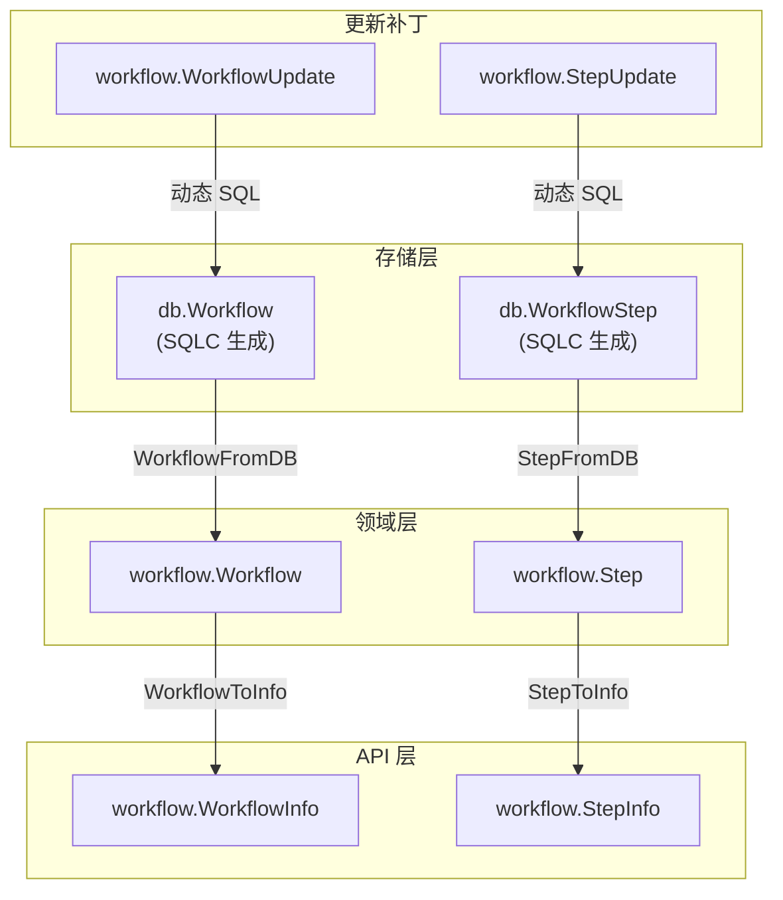

# Crush 状态存储管理设计与实现

本文档详细描述 Crush Workflow Engine 的状态存储管理设计，对齐 HumanLayer 项目的三分结构模式。

## 1. 设计概述

### 1.1 三分结构模式

借鉴 HumanLayer 的设计理念，Crush 采用"三分结构"进行状态管理：



| 结构类型 | 用途 | 对应类型 |
|----------|------|----------|
| **存储结构 (DB Model)** | 数据库表的 Go 绑定，由 SQLC 生成 | `db.Workflow`, `db.WorkflowStep` |
| **领域模型 (Domain)** | 内部业务逻辑使用的类型 | `workflow.Workflow`, `workflow.Step` |
| **Info 视图 (External)** | JSON-safe API 响应视图 | `workflow.WorkflowInfo`, `workflow.StepInfo` |
| **Update 补丁 (Patch)** | 部分字段更新，指针类型表示可选 | `workflow.WorkflowUpdate`, `workflow.StepUpdate` |

### 1.2 设计原则

1. **分离关注点**：存储、业务逻辑、API 各层独立
2. **部分更新**：使用指针字段实现细粒度字段更新，避免覆盖未修改字段
3. **计算字段**：Info 视图包含计算属性（如 Progress、CompletedSteps）
4. **类型安全**：利用 Go 类型系统防止状态错误

---

## 2. 类型定义

### 2.1 状态枚举

#### WorkflowState - 工作流生命周期状态

```go
type WorkflowState string

const (
    WorkflowStateDraft        WorkflowState = "draft"         // 初始化，未开始
    WorkflowStateRunning      WorkflowState = "running"       // 正在执行
    WorkflowStateWaitingInput WorkflowState = "waiting_input" // 等待用户输入/审批
    WorkflowStatePaused       WorkflowState = "paused"        // 用户主动暂停
    WorkflowStateCompleted    WorkflowState = "completed"     // 成功完成
    WorkflowStateFailed       WorkflowState = "failed"        // 失败终止
    WorkflowStateInterrupted  WorkflowState = "interrupted"   // 中断（进程退出/崩溃）
)
```

#### StepStatus - 步骤执行状态

```go
type StepStatus string

const (
    StepStatusPending   StepStatus = "pending"   // 未开始
    StepStatusRunning   StepStatus = "running"   // 执行中
    StepStatusCompleted StepStatus = "completed" // 完成
    StepStatusFailed    StepStatus = "failed"    // 失败
    StepStatusSkipped   StepStatus = "skipped"   // 跳过
    StepStatusWaiting   StepStatus = "waiting"   // 等待审批
)
```

#### ApprovalStatus - 审批状态

```go
type ApprovalStatus string

const (
    ApprovalPending  ApprovalStatus = "pending"  // 待审批
    ApprovalApproved ApprovalStatus = "approved" // 已批准
    ApprovalRejected ApprovalStatus = "rejected" // 已拒绝
)
```

### 2.2 领域模型

#### Workflow - 工作流实例

```go
type Workflow struct {
    ID               string        // 唯一标识
    ParentSessionID  string        // 关联的父 Session
    Title            string        // 标题
    State            WorkflowState // 当前状态
    PlanJSON         string        // 计划（JSON 格式）
    ConfigJSON       string        // 配置（JSON 格式）
    SpecJSON         string        // DAG 规范（JSON 格式）
    CurrentNodeID    string        // 当前 DAG 节点 ID
    CurrentStepIndex int           // 当前步骤索引（顺序工作流）
    ErrorMessage     string        // 错误信息
    CreatedAt        time.Time     // 创建时间
    UpdatedAt        time.Time     // 更新时间
    CompletedAt      *time.Time    // 完成时间
    Steps            []Step        // 步骤列表
}
```

#### Step - 工作流步骤

```go
type Step struct {
    ID               string         // 唯一标识
    WorkflowID       string         // 所属工作流
    StepIndex        int            // 步骤索引
    StepType         StepType       // 步骤类型 (plan/code/review/docs)
    Agent            string         // 执行代理名称
    AgentSessionID   string         // 代理会话 ID（用于恢复）
    Status           StepStatus     // 执行状态
    Title            string         // 步骤标题
    InputContextJSON string         // 输入上下文
    OutputJSON       string         // 执行输出
    ReviewResultJSON string         // 审查结果
    RetryCount       int            // 重试次数
    MaxRetries       int            // 最大重试次数
    RequiresApproval bool           // 是否需要审批
    ApprovalStatus   ApprovalStatus // 审批状态
    ErrorMessage     string         // 错误信息
    NodeID           string         // DAG 节点 ID
    CreatedAt        time.Time      // 创建时间
    UpdatedAt        time.Time      // 更新时间
    StartedAt        *time.Time     // 开始时间
    CompletedAt      *time.Time     // 完成时间
}
```

### 2.3 Info 视图（API 响应）

#### WorkflowInfo

```go
type WorkflowInfo struct {
    ID               string        `json:"id"`
    ParentSessionID  string        `json:"parent_session_id,omitempty"`
    Title            string        `json:"title"`
    State            WorkflowState `json:"state"`
    CurrentStepIndex int           `json:"current_step_index"`
    CurrentNodeID    string        `json:"current_node_id,omitempty"`
    TotalSteps       int           `json:"total_steps"`      // 计算字段
    CompletedSteps   int           `json:"completed_steps"`  // 计算字段
    Progress         float64       `json:"progress"`         // 计算字段 (0.0-1.0)
    ErrorMessage     string        `json:"error_message,omitempty"`
    CreatedAt        time.Time     `json:"created_at"`
    UpdatedAt        time.Time     `json:"updated_at"`
    CompletedAt      *time.Time    `json:"completed_at,omitempty"`
    Steps            []StepInfo    `json:"steps,omitempty"`
}
```

#### StepInfo

```go
type StepInfo struct {
    ID               string         `json:"id"`
    WorkflowID       string         `json:"workflow_id"`
    StepIndex        int            `json:"step_index"`
    StepType         StepType       `json:"step_type"`
    Agent            string         `json:"agent"`
    AgentSessionID   string         `json:"agent_session_id,omitempty"`
    Status           StepStatus     `json:"status"`
    Title            string         `json:"title"`
    NodeID           string         `json:"node_id,omitempty"`
    RetryCount       int            `json:"retry_count"`
    MaxRetries       int            `json:"max_retries"`
    RequiresApproval bool           `json:"requires_approval"`
    ApprovalStatus   ApprovalStatus `json:"approval_status,omitempty"`
    ErrorMessage     string         `json:"error_message,omitempty"`
    CreatedAt        time.Time      `json:"created_at"`
    StartedAt        *time.Time     `json:"started_at,omitempty"`
    CompletedAt      *time.Time     `json:"completed_at,omitempty"`
}
```

### 2.4 Update 补丁（部分更新）

#### WorkflowUpdate

```go
type WorkflowUpdate struct {
    Title            *string        `json:"title,omitempty"`
    State            *WorkflowState `json:"state,omitempty"`
    CurrentStepIndex *int           `json:"current_step_index,omitempty"`
    CurrentNodeID    *string        `json:"current_node_id,omitempty"`
    PlanJSON         *string        `json:"plan_json,omitempty"`
    ConfigJSON       *string        `json:"config_json,omitempty"`
    SpecJSON         *string        `json:"spec_json,omitempty"`
    ErrorMessage     *string        `json:"error_message,omitempty"`
    CompletedAt      *time.Time     `json:"completed_at,omitempty"`
}

// IsEmpty returns true if no fields are set
func (u WorkflowUpdate) IsEmpty() bool
```

#### StepUpdate

```go
type StepUpdate struct {
    Status           *StepStatus     `json:"status,omitempty"`
    AgentSessionID   *string         `json:"agent_session_id,omitempty"`
    InputContextJSON *string         `json:"input_context_json,omitempty"`
    OutputJSON       *string         `json:"output_json,omitempty"`
    ReviewResultJSON *string         `json:"review_result_json,omitempty"`
    RetryCount       *int            `json:"retry_count,omitempty"`
    ApprovalStatus   *ApprovalStatus `json:"approval_status,omitempty"`
    ErrorMessage     *string         `json:"error_message,omitempty"`
    StartedAt        *time.Time      `json:"started_at,omitempty"`
    CompletedAt      *time.Time      `json:"completed_at,omitempty"`
}

// IsEmpty returns true if no fields are set
func (u StepUpdate) IsEmpty() bool
```

---

## 3. 转换函数

### 3.1 DB → Domain

```go
// WorkflowFromDB converts a database Workflow to the domain model.
func WorkflowFromDB(w db.Workflow) Workflow

// StepFromDB converts a database WorkflowStep to the domain model.
func StepFromDB(s db.WorkflowStep) Step
```

### 3.2 Domain → Info

```go
// WorkflowToInfo converts a Workflow domain model to the API-safe Info view.
// Calculates TotalSteps, CompletedSteps, and Progress automatically.
func WorkflowToInfo(w Workflow) WorkflowInfo

// StepToInfo converts a Step domain model to the API-safe Info view.
func StepToInfo(s Step) StepInfo
```

### 3.3 Apply Update

```go
// ApplyWorkflowUpdate applies a WorkflowUpdate to a Workflow.
// Only non-nil fields in the update are applied.
func ApplyWorkflowUpdate(w Workflow, update WorkflowUpdate) Workflow

// ApplyStepUpdate applies a StepUpdate to a Step.
// Only non-nil fields in the update are applied.
func ApplyStepUpdate(s Step, update StepUpdate) Step
```

---

## 4. 存储接口

### 4.1 WorkflowStore 接口

```go
type WorkflowStore interface {
    // Workflow CRUD
    CreateWorkflow(ctx context.Context, workflow *Workflow) error
    GetWorkflow(ctx context.Context, id string) (*Workflow, error)
    UpdateWorkflow(ctx context.Context, id string, updates WorkflowUpdate) error
    DeleteWorkflow(ctx context.Context, id string) error

    // Listing
    ListWorkflows(ctx context.Context) ([]Workflow, error)
    ListWorkflowsBySession(ctx context.Context, sessionID string) ([]Workflow, error)
    ListWorkflowsByState(ctx context.Context, states ...WorkflowState) ([]Workflow, error)

    // Step operations
    CreateStep(ctx context.Context, step *Step) error
    GetStep(ctx context.Context, id string) (*Step, error)
    UpdateStep(ctx context.Context, id string, updates StepUpdate) error
    GetStepsByWorkflow(ctx context.Context, workflowID string) ([]Step, error)
    GetStepByNodeID(ctx context.Context, workflowID, nodeID string) (*Step, error)
    GetCurrentStep(ctx context.Context, workflowID string) (*Step, error)

    // Approval
    GetPendingApprovalSteps(ctx context.Context, workflowID string) ([]Step, error)
    ApproveStep(ctx context.Context, stepID string, approved bool, comment string) error

    // Transaction
    WithTx(ctx context.Context, fn func(store WorkflowStore) error) error
}
```

### 4.2 SQLiteStore 实现

`SQLiteStore` 使用动态 SQL 实现部分字段更新，类似 HumanLayer 的 `UpdateSession` 模式：

实现上会用一个 `conn` 抽象（`*sql.DB` / `*sql.Tx`）来执行 raw SQL，从而保证 `WithTx` 包裹时动态 SQL 更新也处于同一事务中。

```go
func (s *SQLiteStore) UpdateWorkflow(ctx context.Context, id string, updates WorkflowUpdate) error {
    if updates.IsEmpty() {
        return nil // No-op
    }

    query := `UPDATE workflows SET`
    args := []interface{}{}
    setParts := []string{}

    if updates.Title != nil {
        setParts = append(setParts, "title = ?")
        args = append(args, *updates.Title)
    }
    if updates.State != nil {
        setParts = append(setParts, "state = ?")
        args = append(args, string(*updates.State))
    }
    // ... 其他字段

    query += " " + strings.Join(setParts, ", ")
    query += " WHERE id = ?"
    args = append(args, id)

    result, err := s.conn.ExecContext(ctx, query, args...)
    // ...
}
```

---

## 5. 数据库 Schema

以下为应用 `internal/db/migrations/20251213000000_add_workflows.sql` 与 `internal/db/migrations/20251213100000_add_dag_support.sql` 后的最终 schema（包含 DAG 所需字段：`spec_json`、`current_node_id`、`node_id`）。

### 5.1 workflows 表

```sql
CREATE TABLE workflows (
    id TEXT PRIMARY KEY,
    parent_session_id TEXT REFERENCES sessions(id),
    title TEXT NOT NULL,
    state TEXT NOT NULL DEFAULT 'draft',
    plan_json TEXT,
    config_json TEXT,
    spec_json TEXT,
    current_node_id TEXT,
    current_step_index INTEGER NOT NULL DEFAULT 0,
    error_message TEXT,
    created_at INTEGER NOT NULL DEFAULT (strftime('%s','now')),
    updated_at INTEGER NOT NULL DEFAULT (strftime('%s','now')),
    completed_at INTEGER
);

CREATE INDEX idx_workflows_parent_session ON workflows(parent_session_id);
CREATE INDEX idx_workflows_state ON workflows(state);
```

### 5.2 workflow_steps 表

```sql
CREATE TABLE workflow_steps (
    id TEXT PRIMARY KEY,
    workflow_id TEXT NOT NULL REFERENCES workflows(id) ON DELETE CASCADE,
    step_index INTEGER NOT NULL,
    step_type TEXT NOT NULL,
    agent TEXT NOT NULL,
    agent_session_id TEXT,
    status TEXT NOT NULL DEFAULT 'pending',
    title TEXT,
    input_context_json TEXT,
    output_json TEXT,
    review_result_json TEXT,
    retry_count INTEGER NOT NULL DEFAULT 0,
    max_retries INTEGER NOT NULL DEFAULT 3,
    requires_approval INTEGER NOT NULL DEFAULT 0,
    approval_status TEXT,
    error_message TEXT,
    node_id TEXT,
    created_at INTEGER NOT NULL DEFAULT (strftime('%s','now')),
    updated_at INTEGER NOT NULL DEFAULT (strftime('%s','now')),
    started_at INTEGER,
    completed_at INTEGER,
    UNIQUE(workflow_id, step_index)
);

CREATE INDEX idx_workflow_steps_workflow ON workflow_steps(workflow_id);
CREATE INDEX idx_workflow_steps_status ON workflow_steps(status);
```

---

## 6. 使用示例

### 6.1 创建工作流

```go
store := workflow.NewSQLiteStore(queries, database)

wf := &workflow.Workflow{
    ID:    uuid.New().String(),
    Title: "Feature Implementation",
    State: workflow.WorkflowStateDraft,
}

if err := store.CreateWorkflow(ctx, wf); err != nil {
    return err
}
```

### 6.2 部分更新

```go
// 只更新状态和当前步骤
newState := workflow.WorkflowStateRunning
stepIndex := 2

err := store.UpdateWorkflow(ctx, workflowID, workflow.WorkflowUpdate{
    State:            &newState,
    CurrentStepIndex: &stepIndex,
})
```

### 6.3 获取 Info 视图

```go
wf, _ := store.GetWorkflow(ctx, workflowID)
info := workflow.WorkflowToInfo(*wf)

// info.Progress 自动计算
// info.CompletedSteps 自动计算
fmt.Printf("Progress: %.0f%%\n", info.Progress * 100)
```

### 6.4 审批操作

```go
// 批准步骤
err := store.ApproveStep(ctx, stepID, true, "Looks good!")

// 拒绝步骤
err := store.ApproveStep(ctx, stepID, false, "Needs revision")
```

---

## 7. 文件索引

| 文件 | 描述 |
|------|------|
| [`internal/workflow/types.go`](../../internal/workflow/types.go) | 所有类型定义（领域模型、Info、Update） |
| [`internal/workflow/store.go`](../../internal/workflow/store.go) | WorkflowStore 接口定义 |
| [`internal/workflow/sqlite_store.go`](../../internal/workflow/sqlite_store.go) | SQLite 存储实现 |
| [`internal/workflow/engine.go`](../../internal/workflow/engine.go) | 工作流执行引擎 |
| [`internal/db/sql/workflows.sql`](../../internal/db/sql/workflows.sql) | SQLC 查询定义 |
| [`internal/db/migrations/20251213000000_add_workflows.sql`](../../internal/db/migrations/20251213000000_add_workflows.sql) | 工作流/步骤表与触发器 |
| [`internal/db/migrations/20251213100000_add_dag_support.sql`](../../internal/db/migrations/20251213100000_add_dag_support.sql) | DAG 字段支持（`spec_json`/`current_node_id`/`node_id`） |

---

## 8. 参考

- [HumanLayer Session 管理](https://github.com/humanlayer/humanlayer/blob/main/hld/store/store.go)
- [Crush 工作流编排设计](./00_Orchestration_Design.md)
- [Crush 工作流引擎实现](./01_Workflow_Engine_Implementation.md)
